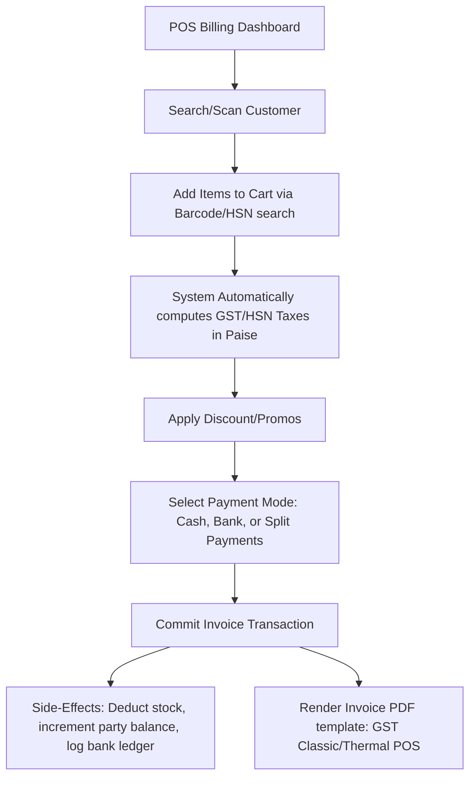
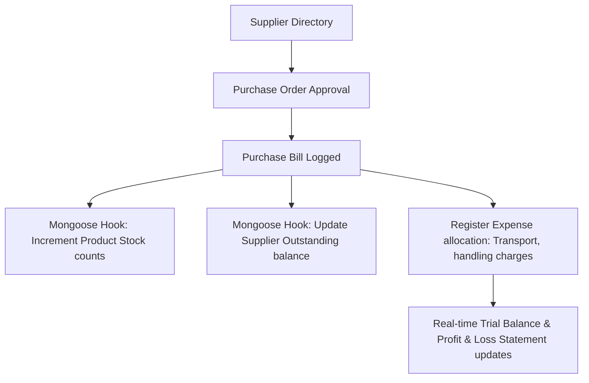
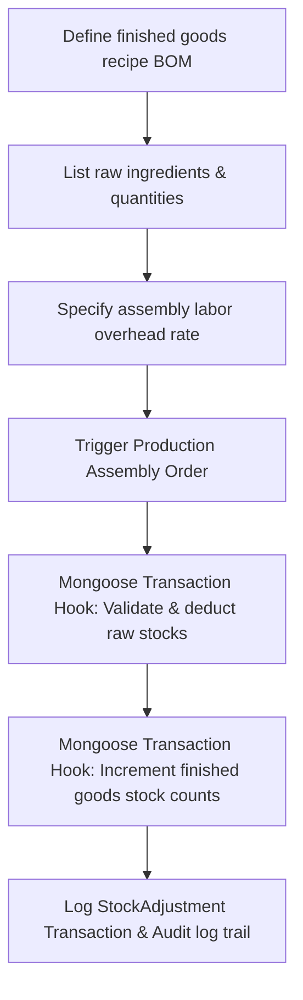
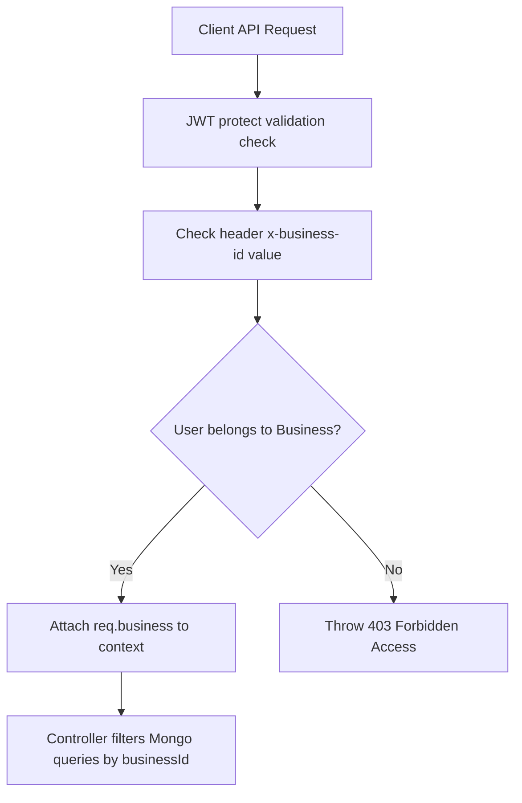
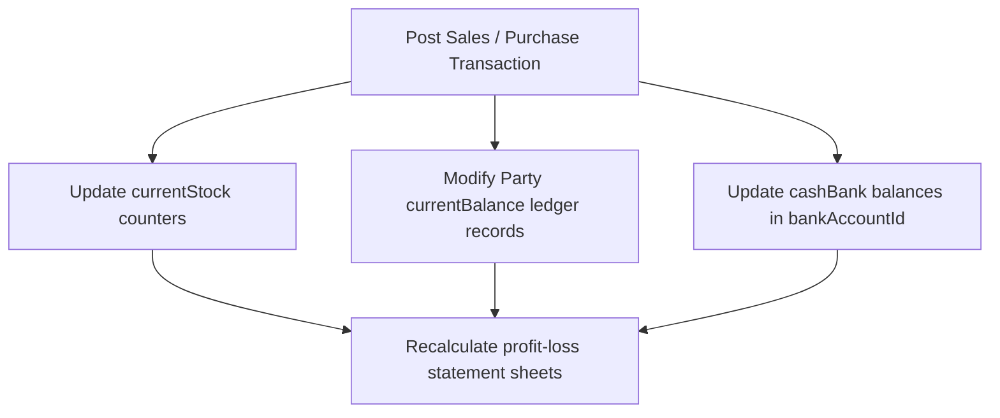
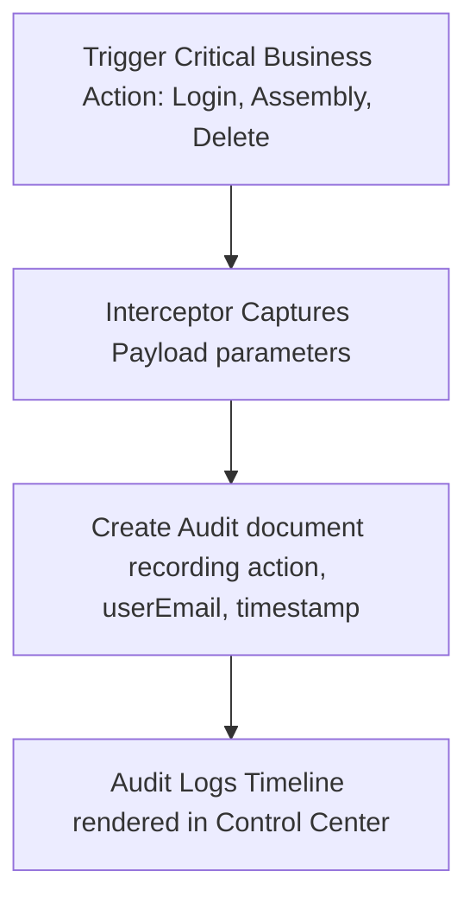

# 💼 Vyapar Clone: Multi-Firm Enterprise Accounting & ERP System

This repository contains an enterprise-grade Business Accounting, Point of Sale (POS) Billing, Inventory Control, and Multi-Branch Management ERP system modeled after **Vyapar**. 

Designed for high performance, accuracy, and modularity, the system uses a **Node.js/Express/MongoDB** backend paired with a **Dart/Flutter** desktop/mobile client using Riverpod state management.

---

## 📐 Overall System Workflow

The diagrams below outline the primary data pipelines, transaction cycles, and reporting linkages inside the ERP.

### 1. Point of Sale (POS) Billing & Invoicing Flow


### 2. Purchase & Inventory Reorder Loop


### 3. Manufacturing Bill of Materials (BOM) Cycle


### 4. Multi-Firm Tenant Middleware Routing Flow


### 5. Double-Entry Side-Effects Pipeline


### 6. Security Audit Log Interceptor Loop


---

## 📂 Project Directory Structure

```text
Vyapar_Clone/
├── backend/                       # Node.js Express Backend
│   ├── src/
│   │   ├── config/                # Database connection utilities
│   │   ├── controllers/           # Route handler controllers
│   │   │   ├── auth.controller.js
│   │   │   ├── bank.controller.js
│   │   │   ├── enterprise.controller.js
│   │   │   ├── financials.controller.js
│   │   │   ├── item.controller.js
│   │   │   ├── party.controller.js
│   │   │   └── transaction.controller.js
│   │   ├── middleware/            # JWT validation & Tenant Multi-Firm checks
│   │   ├── models/                # Mongoose database schemas
│   │   │   ├── apikey.model.js
│   │   │   ├── audit.model.js
│   │   │   ├── bank.model.js
│   │   │   ├── bom.model.js
│   │   │   ├── branch.model.js
│   │   │   ├── employee.model.js
│   │   │   ├── item.model.js
│   │   │   ├── monitoring.model.js
│   │   │   ├── party.model.js
│   │   │   └── transaction.model.js
│   │   ├── routes/                # Express API Route mappings
│   │   ├── server.js              # Express app initialization
│   │   └── test_client.js         # Integration E2E test client suite
│   ├── .env                       # Env parameters (DB URI, Ports, Secret keys)
│   └── package.json
│
└── frontend/                      # Dart/Flutter Desktop Client App
    ├── lib/
    │   ├── main.dart              # App bootstrap entry
    │   └── src/
    │       ├── core/              # Global theme configs & Dio networking
    │       ├── providers/         # Riverpod State notifier engines
    │       └── screens/           # UI Screens & Widgets
    │           ├── auth/          # Login/Register interfaces
    │           ├── dashboard/     # Home metrics lists
    │           ├── items/         # Catalog forms
    │           ├── parties/       # Ledger directories
    │           ├── purchase/      # Procurement trackers
    │           ├── sales/         # POS bill forms
    │           └── utilities/     # Reorganized feature subfolders
    │               ├── core_shell/          # Sidebar layouts
    │               ├── banking_finance/     # Cash, bank register, expenses
    │               ├── tools_utilities/     # Manufacturing, spreadsheet imports
    │               ├── backup_security/     # Backups, audit timelines
    │               ├── settings_firm/       # Tax, branches, dev keys
    │               ├── assistant_search/    # Search filters, BI meters, alerts
    │               └── erp_screens.dart     # Barrel file router
```

---

## ⚡ Granular Feature Matrix

### 1. POS Billing & Document Invoicing
#### Major Features
*   **Split Payments Engine**: Lets users split transaction receipts across different channels (e.g. part Cash, part Card, part UPI).
*   **Document Conversions**: Streamlines sales orders by converting Estimates, Quotations, and Sales Orders into final Sales Invoices with a single click.
*   **Multi-Format Prints**: Automatically generates A4 and Thermal POS receipts with dynamic layouts (GST Classic, Thermal POS).

#### Minor Features
*   **Invoice Discounts**: Allows custom percentage and flat rate deductions per cart line.
*   **Taxes Settings**: Binds item HSN rates (5%, 12%, 18%, 28%) with automated calculations.
*   **Dual Descriptions**: Add transaction notes and specific product notes on lines.

### 2. Multi-Firm tenanting & Branch Operations
#### Major Features
*   **Tenant Separation**: The `x-business-id` header validation interceptor ensures complete segregation of party ledgers and stock catalogs under different companies.
*   **Multi-Branch Warehousing**: Register branches and track their specific warehouse assets dynamically.

#### Minor Features
*   **Role-Based Access**: Binds staff profiles to specific roles (Manager, Accountant, Cashier).
*   **Invited Logins**: Let employees access specific branches using their registered phone lines.

### 3. Inventory Control & Manufacturing (BOM)
#### Major Features
*   **BOM Recipes**: Defines raw materials list, target quantity yields, and labor overheads to assemble finished goods.
*   **Production Orders**: Adjusts inventories by decrementing raw components and incrementing target stock automatically upon completion.

#### Minor Features
*   **Minimum Stock Warnings**: Binds min-stock flags to trigger alerts in the dashboard.
*   **Spreadsheet Importers**: Allows importing thousands of products from Excel/CSV templates.

### 4. Banking & Financial Book Keeping
#### Major Features
*   **Double-Entry side effects**: Recording transaction lines automatically modifies bank account balances and party ledger accounts.
*   **Day Book Registers**: Keeps log listings of cash flow transfers and ATM withdrawals.

#### Minor Features
*   **Reconciliations logs**: Reconcile transfers between Main HDFC bank and Cash Book ledgers.
*   **Expense logs**: Classify operational overheads (e.g. rent, electricity).

### 5. Reporting & Business Intelligence
#### Major Features
*   **P&L Statement Sheets**: Displays gross revenues, Cost of Goods Sold (COGS), operating expenses, and net profit margins.
*   **Balance Sheets & Trial Balances**: Live monitors assets, liabilities, equities, and balances.

#### Minor Features
*   **GSTR Reports**: Automatically formats GST reports.
*   **Dashboard Charts**: Displays transaction KPI metrics.

---

## 🚀 Getting Started

### 1. Backend Server Setup
1. Navigate to backend:
   ```bash
   cd backend
   ```
2. Install dependencies:
   ```bash
   npm install
   ```
3. Start development server:
   ```bash
   npm start
   ```

### 2. Frontend Client Setup
1. Navigate to frontend:
   ```bash
   cd frontend
   ```
2. Resolve pub dependencies:
   ```bash
   flutter pub get
   ```
3. Run desktop application:
   ```bash
   flutter run -d windows
   ```
